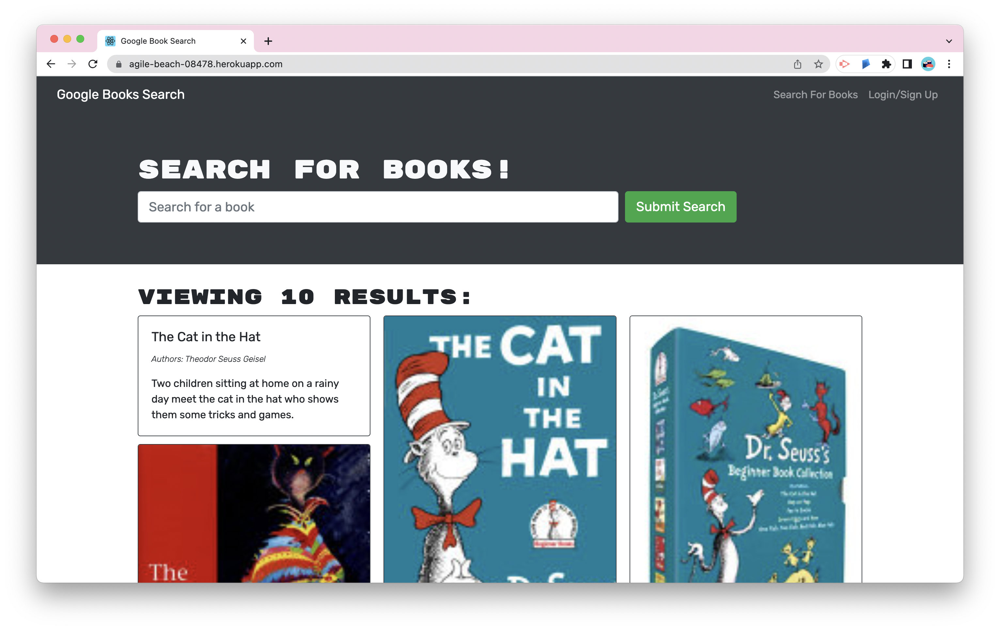

# MERN Book Search Engine 📚🔍


## Description

A full-stack Google Books API search engine built with a RESTful API, and refactored to be a GraphQL API with Apollo Server, This application was built using the MERN stack, and the following technologies:

- MongoDB
- Mongoose ODM
- Express.js
- React
- React Router
- Node.js
- Apollo
- GraphQL
- Bootstrap
- Javascript Web Token
- Google Books API

<br>

## Table of Contents

- [Installation](#installation)
- [Usage](#usage)
- [License](#license)
- [Deployed Link](#deployed-link)
- [Questions](#questions)  
  <br>

## Installation

Use the following command to download dependencies for the project:

```
npm install
```

  <br>

## Usage



The MERN Book Search Engine allows user's to search for a book using the Google Books API. The results are returned with an image, book title, authors, and a description. If a user is signed up and logged in, the user is able to save the book. In the user's saved book page, the user can also remove the books that they've saved.

 <br>

## License

This project is licensed under the [MIT License](https://choosealicense.com/licenses/mit/).  
 </br>

## Deployed Link

https://agile-beach-08478.herokuapp.com/

## Questions

[GitHub](https://github.com/dneflas)
